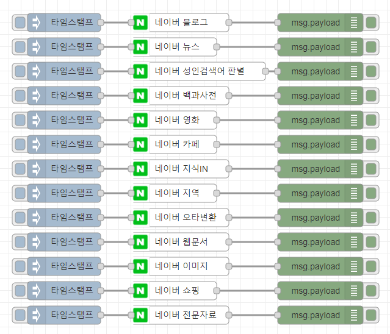

node-red-contrib-naversearch
================

Node-RED node for naversearch


## Install

To install the stable version use the `Menu - Manage palette - Install`
option and search for node-red-contrib-naversearch, or run the following
command in your Node-RED user directory, typically `~/.node-red`

    npm install node-red-contrib-naversearch

## Wrapper naver search  API  
- https://developers.naver.com/docs/serviceapi/search/blog/blog.md

## Sample parameters
```js

msg.api = 'blog'; //# API : blog,news,book,adult,encyc,movie,cafearticle,kin,local,errata,webkr,image,shop,doc 

msg.params = {};
msg.params.query = '테슬라'; //#검색어
msg.params.display = "10" // #출력 검색 수
msg.params.sort = 'date' //#결과값의 정렬기준 시간순 date, 관련도 순 sim
msg.params.start = "1" //# 출력 위치

return msg;

```

## Sample Flow
You can make this json string into a flow by using the node-red flow import function.

- [sample.json](examples/sample.json)


